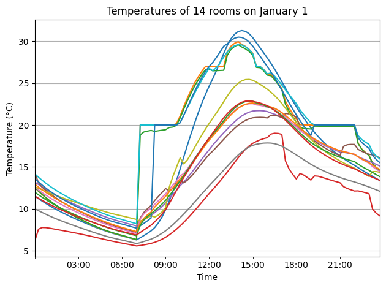

# Heat Load Calculation (Go)

[](https://github.com/BRI-EES-House/heat_load_calc_go/actions/workflows/build-test.yml)


## About
This repository is a simple port of heat_load_calc (ecd058687246bc60512c9205bd760d8ce3fddea0) to Go. However, some processes such as unit test codes have been omitted.


## Quick Start

```
$ go run main.go -i example/jjj.json -o out --region=6
```

For example, the results can be easily visualized using Matplotlib as follows

```
import pandas as pd
import matplotlib.pyplot as plt
import matplotlib.dates as mdates

fname = "out/result_detail_i.csv".format(region, model)
df = pd.read_csv(fname)
df['start_time'] = pd.to_datetime(df['start_time'])
df = df.set_index('start_time')

plt.figure()

# Plot temperatures of 14 rooms on January 1
for j in range(14):
    df["rm{}_t_r".format(j)].iloc[:24*4].plot()

plt.gca().xaxis.set_major_formatter(mdates.DateFormatter('%H:%M'))
plt.gca().xaxis.set_major_locator(mdates.HourLocator(interval=1))
plt.ylabel('Temperature (°C)')
plt.xlabel('Time')
plt.title('Temperatures of 14 rooms on January 1')
plt.tight_layout()
plt.grid(True)
plt.show()
```



## Policy
For the sake of simplicity, the naming conventions of the Go language are ignored and are faithful to the original; since lower-case beginnings are private in the Go language, there is no package separation and everything is included in the main package.

A large number of power calculations and trigonometric functions are performed in sun position calculations, etc., but the speed reduction caused by these functions cannot be ignored, so they are multiplied or read back to literals as appropriate.

Gonum is used for numerical calculation, but it does not support broadcast unlike numpy, so there are many places to expand with For statement. Gonum is designed to save memory allocation time by processing while overwriting variable areas, but this has not been utilized at this time.


## Optimization of execution speed

### Using LU decomposition or inverse matrix
The solution of the matrix must be frequently sought. Depending on the situation, the inverse matrix is obtained in advance and the inner product is obtained every hour, or the LU decomposition is performed in advance.

### High frequency memory allocation and release
The memory of matrices generated as local variables in run_tick is always allocated to save the cost of repeated memory allocation and deallocation.

### Skip zero matrix calculation
Frequent or constant zero matrices appear depending on the schedule and settings, such as air conditioning operation. Since it is obvious that the inner product with the zero matrix is zero, the related operations are skipped.

### BLAS
Gonum seems to be aware of the speedup that can be achieved by using BLAS, but it did not run fast when bound to OpenBLAS or IntelMKL. It is thought that it did not benefit from the small matrix size it handles.

## Performance
Calculations are completed in less than 2 seconds for the 3-rooms model and less than 10 seconds for the 14-rooms model. The calculation includes a six-month ground calculation, a six-month run-up calculation, and a one-year main calculation, for a total of two years. All calculations are performed at 15-minute intervals.

## Test

Verify that the output is consistent with the confirmed calculation results.
This check is performed automatically on the main branch.

```
$ ./test/gen_csv.sh
$ cd test
$ ./check.sh
Check result_detail_a.csv and region_6_jjj/result_detail_a.csv
```